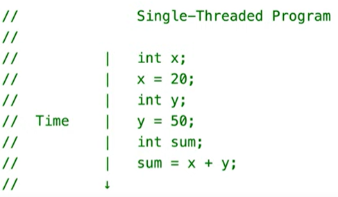
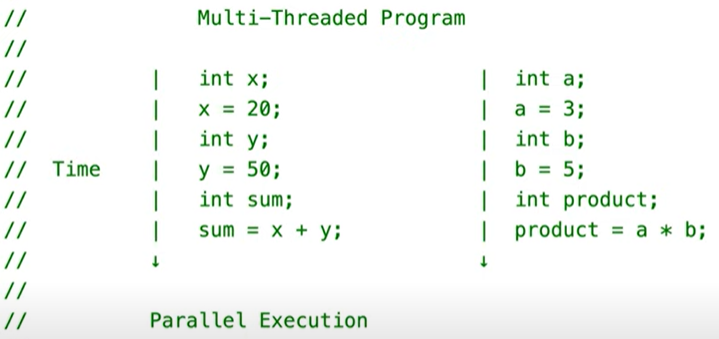
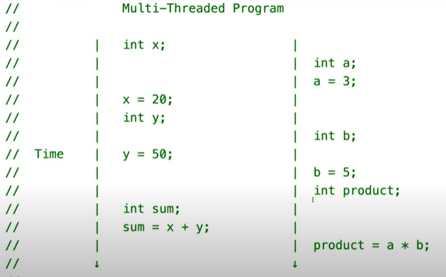

# 🍝 Philosophers
🔹 Objectives:
- Learn the basics of threading a process
- Learn about creating threads and mutexes

# Contents:
1. [Introduction](https://github.com/Thuggonaut/42IC_Ring03_Philosophers/blob/main/README.md#-introduction)
2. [The rules](https://github.com/Thuggonaut/42IC_Ring03_Philosophers/blob/main/README.md#-the-rules)
3. [The Mandatory part](https://github.com/Thuggonaut/42IC_Ring03_Philosophers/blob/main/README.md#-mandatory-rules)
4. [External functions to learn](https://github.com/Thuggonaut/42IC_Ring03_Philosophers/blob/main/README.md#-external-functions-to-learn)
5. [Pseudo code](https://github.com/Thuggonaut/42IC_Ring03_Philosophers/blob/main/README.md#-pseudo-code)
6. [Evaluation Checklist](https://github.com/Thuggonaut/42IC_Ring03_Philosophers/blob/main/README.md#-evaluation-checklist)
7. [References](https://github.com/Thuggonaut/42IC_Ring03_Philosophers/blob/main/README.md#-references)

# 🔷 Introduction:
Create a simulation of philosphers dining:
- One or more philosophers sit at a round table.
	- There is a large bowl of spaghetti in the middle of the table.
- The philosophers alternatively eat, think, or sleep.
	- While they are eating, they are not thinking nor sleeping;
	- while thinking, they are not eating nor sleeping;
	- and, of course, while sleeping, they are not eating nor thinking.
- There are also forks on the table. There are as many forks as philosophers.
- Because serving and eating spaghetti with only one fork is very inconvenient, a philosopher takes their right and their left forks to eat, one in each hand.
- When a philosopher has finished eating, 
	- they put their forks back on the table and start sleeping. 
	- Once awake, they start  thinking again. 
	- The simulation stops when a philosopher dies of starvation.
- Every philosopher needs to eat and should never starve.
- Philosophers don’t speak with each other.
- Philosophers don’t know if another philosopher is about to die.
- No need to say that philosophers should avoid dying!


# 🔷 The Rules:

### 1️⃣ No global variables

### 2️⃣ Your(s) program(s) should take the following arguments:
#### 1. 🔸 `number_of_philosophers`: 
- The number of philosophers and also 
- the number of forks.
#### 2. 🔸 `time_to_die` (in milliseconds): 
- If a philosopher didn’t start eating `time_to_die` milliseconds since the beginning of their last meal or the beginning of the simulation, they die.
#### 3. 🔸 `time_to_eat` (in milliseconds): 
- The time it takes for a philosopher to eat.
- During that time, they will need to hold two forks.
#### 4. 🔸 `time_to_sleep` (in milliseconds): 
- The time a philosopher will spend sleeping.
#### 5. 🔸 `number_of_times_each_philosopher_must_eat` (optional argument): 
- If all philosophers have eaten at least `number_of_times_each_philosopher_must_eat` times, the simulation stops. 
- If not specified, the simulation stops when a philosopher dies.

### 3️⃣ Each philosopher has a number ranging from `1` to `number_of_philosophers`.

### 4️⃣ Philosopher number `1` sits next to philosopher number `number_of_philosophers`.
- Any other philosopher number `N` sits between philosopher number `N - 1` and philosopher number `N + 1`.

### 5️⃣ About the logs of your program:
1. 🔸 Any state change of a philosopher must be formatted as follows:
- `timestamp_in_ms` X has taken a fork
- `timestamp_in_ms` X is eating
- `timestamp_in_ms` X is sleeping
- `timestamp_in_ms` X is thinking
- `timestamp_in_ms` X died
2. 🔸 Replace `timestamp_in_ms` with the current timestamp in milliseconds and `X` with the philosopher number.
3. 🔸 A displayed state message should not be mixed up with another message.
4. 🔸 A message announcing a philosopher died should be displayed no more than 10 ms after the actual death of the philosopher.
5. 🔸 Again, philosophers should avoid dying!
6. 🔸 Your program must not have any data races.
- 🧐 ***What are data races?***
- A data race is an instance of a race condition where multiple threads compete to access and modify shared data (variable or state) at the same time, leading to unpredictable outcomes.
- A race condition is when a program depends on the timing or order of events, leading to issues.
	- For instance, in a multithreaded environment, a data race may occur when multiple threads attempt to execute a function that involves shared variables. This simultaneous access can lead to inconsistencies, causing the final value of a variable to be out of sync with the expected result due to the unpredictable interleaving of thread executions. 
- Proper synchronization mechanisms such as mutexes or semaphores are essential to prevent race conditions.


# 🔷 Mandatory rules:

### 1️⃣ Each philosopher should be a thread.
- 🧐 ***What is a thread?***
	- Threads can improve performance.
	- Single threaded program
		- One sequence of statements that executes over time 
	- Multi threaded program
		- Multiple sequence of statements that executes over the same period of time
		- Parallel execution:
			- Though, not always possible to execute threads in parallel due to hard/software 
		- Concurrent execution when parallel not possible:
			- CPU switches back and forth bewtween multiple threads
			- only one thread is executed at any given time. 
- 🧐 ***How to create a thread?***
- We use the <pthread.h> library.
	1. 🔸Call `pthread_create()` to create a thread.
	2. 🔸Give `pthread_create()` a function to run.
		- the function will run in it's own thread. 
	3. 🔸Call `pthread_join()` to join the newly created thread back to the main thread. 
		- `pthread_join()` by the time it runs, will pause and wait until the created thread finishes execution if it hasn't already [img]


### 2️⃣ There is one fork between each pair of philosophers. 
- Therefore, if there are several philosophers, each philosopher has a fork on their left side and a fork on their right side. 
- If there is only one philosopher, there should be only one fork on the table.

### 3️⃣ To prevent philosophers from duplicating forks, you should protect the forks state with a mutex for each of them.
- 🧐 ***What are mutexes?***
- Short for mutual exclusion, a mutex is a synchronization mechanism to control access to shared resources, allowing only one thread or process at a time to execute a critical section of code.
- We can allow one thread to access a section of code (e.g. a thread function) at a time, by locking it. This way, only one thread can execute said code at any given time. 
	- We create a lock before the citical code
	- And release the lock after the critical code is done executing.
	- What happens then, is when the first thread reaches the lock in the code, that thread aquires the lock. 
	- Any subsequent threads when reaching this lock, will pause, and wait until the lock has been released, in order to aquire it. 
- Basically, how a mutex works is, a thread will aquire a lock, run the execution of the code, then release the lock when done. 

- 🧐 ***Example of using a mutex:***
1. In main() We make a mutex variable;
2. In main() Initialize the mutex;
3. In main() Destroy the mutex when done;
4. In thread function() Use the mutex to create the lock;
5. In thread function() Release the lock when done executing;
```c
pthread_mutex_t mutex; //Variable 'mutex'

//Initialize 'mutex' taking in a pointer to our mutex variable, and NULL (default configuration values)
pthread_mutex_init(&mutex, NULL);

pthread_mutex_destroy(&mutex); //When we're done with it, destroy it

//Inside a function or block of code, create a lock
pthread_mutex_lock(&mutex);

//After the code execution, still inside the function or code block, release the lock
pthread_mutex_unlock(&mutex);
```
- What happens is, the function is running at the same time in multiple threads:
	- One thread will reach the lock statement first, aquire the lock, run the code, then unlock.
	- Meanwhile, another thread will reach the lock statement, but it will pause, and wait for the lock to be released.
	- Once the next thread aquires the lock, it'll execute the code, with the updated variables/data. 


# 🔷 External functions to learn:

1. 🔸 **usleep:** _Suspend the execution of a program to introduce a delay for a specified number of microseconds._
2. 🔸 **gettimeofday:** _Obtain the current time._
3. 🔸 **pthread_create:** _Create a new thread within a program._
4. 🔸 **pthread_detach:**_ Detach the newly created thread to allow it to run independently._
5. 🔸 **pthread_join:** _Wait for the thread with ID thread_id to finish its execution._
6. 🔸 **pthread_mutex_init:** _Initialize a mutex._
7. 🔸 **pthread_mutex_destroy:** _Destroy the mutex after it has been used._
8. 🔸 **pthread_mutex_lock:** _Lock the mutex before accessing and updating the shared data._
9. 🔸 **pthread_mutex_unlock:** _Unlock the mutex, allowing other threads to access the shared resource._

Also permitted:
**memset, printf, malloc, free, write**

<table>
	<tr>
		<th> 🔸 usleep() </th>
		<th> </th>
	</tr>
	<tr>
		<th> Use </th>
		<td> Suspend the execution of a program to introduce a delay for a specified number of microseconds </td>
	</tr>
	<tr>
		<th> Library & Syntax </th>
		<td> 

```c
<unistd.h>

int usleep(useconds_t microseconds);
``` 
</td>
		</tr>
		<tr>
		<th> Example </th>
		<td>

```c
#include <unistd.h>
#include <stdio.h>
#include <errno.h>

int main(void) 
{
	printf("Sleeping for 2 seconds...\n");

	int result = usleep(2000000);

	if (result == 0) 
		printf("Woke up after sleeping.\n");
	else 
	{
		perror("Error in usleep");
		return (-1);
	}
	return (0);
}
```
</td>
		</tr>
</table>

<table>
	<tr>
		<th> 🔸 gettimeofday() </th>
		<th> </th>
	</tr>
	<tr>
		<th> Use </th>
		<td> Obtain the current time </td>
	</tr>
	<tr>
		<th> Library & Syntax </th>
		<td> 

```c
<sys/time.h>

int gettimeofday(struct timeval *tv, struct timezone *tz);
``` 
</td>
		</tr>
		<tr>
		<th> Example </th>
		<td>

```c
#include <stdio.h>
#include <sys/time.h>

int main(void) 
{
	struct timeval current_time;

	// Get the current time
	if (gettimeofday(&current_time, NULL) == 0) 
		printf("Current Time: %ld microseconds\n", current_time.tv_usec);
	else 
	{
		perror("Error getting time");
		return (-1);
	}
	return (0);
}
```
</td>
		</tr>
</table>

<table>
	<tr>
		<th> 🔸 pthread_create() </th>
		<th> </th>
	</tr>
	<tr>
		<th> Use </th>
		<td> Create a new thread within a program </td>
	</tr>
	<tr>
		<th> Library & Syntax </th>
		<td> 

```c
<pthread.h>

int	pthread_create(pthread_t *thread_id, const pthread_attr_t *attr,
					void *(*thread_function) (void *), void *arg);
``` 
</td>
		</tr>
		<tr>
		<th> Example </th>
		<td>

```c
#include <pthread.h>
#include <stdio.h>

void	*thread_function(void *arg) 
{
	// Casting the void pointer *arg being passed in, to 'long *'
	long	*arg_num = (long *)(arg); 

	printf("Arg: %ld\n", *arg_num);
	return (NULL);
}

int main(void) 
{
	pthread_t	id_1;
	pthread_t	id_2; // Multiple threading
	
	// An example value we want to pass in thread_function via a pointer
	long		value1 = 1; 
	long		value2 = 2;

	// Create a new thread, accessing the memory address of value1&2, casting it to 'void *'
	// Call the thread_function twice, with two different values, running in two different threads
	pthread_create(&id_1, NULL, thread_function, (void *) &value1);
	pthread_create(&id_2, NULL, thread_function, (void *) &value2);

	// Wait for the thread to finish
	pthread_join(id_1, NULL);
	pthread_join(id_2, NULL);

	return (0);
}
```
</td>
		</tr>
</table>

<table>
	<tr>
		<th> 🔸 pthread_detach() </th>
		<th> </th>
	</tr>
	<tr>
		<th> Use </th>
		<td> 
		
Detach the newly created thread (thread_id) 
- This means that the resources associated with the thread will be automatically released when the thread exits, and the main thread does not need to explicitly join it.
- The difference is, `pthread_join()` is used when you want the main thread to wait for the completion of a specific thread. 
	- This is useful when the main thread needs the results produced by the other thread or when synchronization is necessary.
- Whereas, `pthread_detach()` is used when you want to detach a thread and let it run independently. 
	- The resources associated with the thread will be automatically released when the thread exits. 
	- This is useful when you don't need to wait for the thread to finish and don't need its return value.
</td>
	</tr>
	<tr>
		<th> Library & Syntax </th>
		<td> 

```c
<pthread.h>

int pthread_detach(pthread_t thread_id);
``` 
</td>
		</tr>
		<tr>
		<th> Example </th>
		<td>

```c
#include <pthread.h>
#include <stdio.h>
#include <unistd.h>

void *thread_function(void *arg) 
{
	// Thread logic goes here
	printf("Thread is running...\n");
	usleep(200000);
	printf("Thread is done.\n");

	pthread_exit(NULL);
}

int main(void) 
{
	pthread_t thread_id;
		
	pthread_create(&thread_id, NULL, thread_function, NULL);

	// Detach the thread to allow it to run independently
	pthread_detach(thread_id);

	printf("Main thread is continuing its execution...\n");

	// Main thread doesn't need to join the detached thread

	return (0);
}
```
</td>
		</tr>
</table>

<table>
	<tr>
		<th> 🔸 pthread_join() </th>
		<th> </th>
	</tr>
	<tr>
		<th> Use </th>
		<td> Wait for the thread with ID thread_id to finish its execution </td>
	</tr>
	<tr>
		<th> Library & Syntax </th>
		<td> 

```c
<pthread.h>

int pthread_join(pthread_t thread_id, void **retval);
``` 
</td>
		</tr>
		<tr>
		<th> Example </th>
		<td> See example in pthread_create() </td>
		</tr>
</table>

<table>
	<tr>
		<th> 🔸 pthread_mutex_init() </th>
		<th> </th>
	</tr>
	<tr>
		<th> Use </th>
		<td> Initialize a mutex </td>
	</tr>
	<tr>
		<th> Library & Syntax </th>
		<td> 

```c
<pthread.h>

int pthread_mutex_init(pthread_mutex_t *mutex, const pthread_mutexattr_t *attr);
``` 
</td>
		</tr>
		<tr>
		<th> Example </th>
		<td>

```c
#include <pthread.h>
#include <stdio.h>

int main(void) 
{
	//Declare mutex variable
	pthread_mutex_t my_mutex;

	// Initialize the mutex for synchronization
	pthread_mutex_init(&my_mutex, NULL);

	// Destroy the mutex when it's no longer needed
	pthread_mutex_destroy(&my_mutex);

	return (0);
}
```
</td>
		</tr>
</table>

<table>
	<tr>
		<th> 🔸 pthread_mutex_destroy() </th>
		<th> </th>
	</tr>
	<tr>
		<th> Use </th>
		<td> Destroy the mutex after it has been used </td>
	</tr>
	<tr>
		<th> Library & Syntax </th>
		<td> 

```c
<pthread.h>

int pthread_mutex_destroy(pthread_mutex_t *mutex);
``` 
</td>
		</tr>
		<tr>
		<th> Example </th>
		<td>

```c
#include <pthread.h>
#include <stdio.h>

void *thread_function(void *arg) 
{
	// Thread logic using the mutex goes here
	pthread_mutex_lock(&my_mutex);
	printf("Thread inside the critical section.\n");
	pthread_mutex_unlock(&my_mutex);

	pthread_exit(NULL);
}

int main(void) 
{
	//Declare mutex variable
	pthread_mutex_t my_mutex;

	// Initialize the mutex for synchronization
	pthread_mutex_init(&my_mutex, NULL);

	pthread_t thread_id;

	pthread_create(&thread_id, NULL, thread_function, NULL);

	// Thread function is called on &thread_id

	// Wait for the thread to finish
	pthread_join(thread_id, NULL);

	// Destroy the mutex when it's no longer needed
	pthread_mutex_destroy(&my_mutex);

	return (0);
}
```
</td>
		</tr>
</table>

<table>
	<tr>
		<th> 🔸 pthread_mutex_lock() </th>
		<th> </th>
	</tr>
	<tr>
		<th> Use </th>
		<td> Lock the mutex before accessing and updating the shared data </td>
	</tr>
	<tr>
		<th> Library & Syntax </th>
		<td> 

```c
<pthread.h>

int pthread_mutex_lock(pthread_mutex_t *mutex);
``` 
</td>
		</tr>
		<tr>
		<th> Example </th>
		<td> See example in pthread_mutex_destroy() </td>
		</tr>
</table>

<table>
	<tr>
		<th> 🔸 pthread_mutex_unlock() </th>
		<th> </th>
	</tr>
	<tr>
		<th> Use </th>
		<td> Unlock the mutex, allowing other threads to access the shared resource </td>
	</tr>
	<tr>
		<th> Library & Syntax </th>
		<td> 

```c
<pthread.h>

int pthread_mutex_unlock(pthread_mutex_t *mutex);
``` 
</td>
		</tr>
		<tr>
		<th> Example </th>
		<td> See example in pthread_mutex_destroy() </td>
		</tr>
</table>


# 🔷 Pseudo code:
```c
//We need data structs:

	//For each philo, containing:
		//Philo ID, a thread
		//Fork pointers
		//Mutex
		//Whatever relevant to rules

	//For each fork
		//Mutex
		//ID

	//For the simulation data
		//Handle the mandatory rules
		//A pointer to the philo array (of structs)
		//A pointer to the fork array (of mutexes)
		//Mutex


//Write a skeleton in main()

	//Parse inputs
		//Convert each "time_to" inputs to milliseconds
		//Handle input errors
		//Handle the optional input of the total meals a philo must eat

	//Initialize data

		//malloc an array of philos
			//Initalize the philo data
			//Initialize the philo mutex before use

		//malloc an array of forks
			//Initialize the fork mutex before use
			//Assign left and right forks for each philo
			//Handle a single philo thread
	
	//Execute the simulation

		//Create a thread for each philo
		//Create a thread to check for deaths

		//Synchronise the philos eating to avoid deadlock/resouce contention
			//All even numbered philos eat while odds wait, and alternate
			//Utilize delay mechanisms like usleep() to avoid philos attempting busy forks

		//Print to the STDOUT the philo states with their timestamps
		//Don't forget to use pthread_join to wait for all threads to complete execution (the dining)
		
	//Clean up and free things to avoid memory leaks
```


# 🔷 Evaluation Checklist:

🔸 **Error Handling:**
1. Does not crash or have undefined behaviour.
2. Does not have memory leaks.
3. No norm errors.
4. No global variables.
5. Defend if the program doesn't work on slower machines and test with modifying the thinking_time multiplier.

🔸 **Code checks and rationale for each:**
1. There is one thread per philosopher.
2. There is one fork per philosopher.
3. There is a mutex per fork. The mutex is used to check the fork value and/or change it.
4. The output view is never scrambled.
5. The death of a philospher can be checked.
6. There is a mutex to protect when a philosopher dies and starts eating at the same time.

🔸 **Testing:**
1. Should not test with more than 200 philosphers.
2. Should not test when either `time_to_die`, `time_to_eat` or `time_to_sleep` is under 60`ms`.
3. Test with `1 800 200 200`: the philosopher should not eat and should die.
4. Test with `5 800 200 200`: no one should die.
5. Test with `5 800 200 200 7`: no one should die, and the simulation should stop when all the philosophers has eaten at least 7 times each.
6. Test with `4 410 200 200`: no one should die.
7. Test with `4 310 200 100`: one philosopher should die.
8. Test with 2 philosphers and check the different times: a death delayed by more than 10 ms is unacceptable.
9. Test with any values of your choice to verify all the requirements. Ensure philosophers die at the right time, that they don't steal forks, etc.

# 🔷 References:

- [Introduction To Threads (pthreads)](https://www.youtube.com/watch?v=ldJ8WGZVXZk)
An introduction on how to use threads in C with the pthread.h library (POSIX thread library).

- [Unix Threads in C](https://youtube.com/playlist?list=PLfqABt5AS4FmuQf70psXrsMLEDQXNkLq2&si=0QgGb_xmrDESzk62)
Playlist of all things threads related.

- [The dining Philosophers in C](https://youtu.be/zOpzGHwJ3MU?si=-C45_b4npZc_n4p6)
Oceano's walkthrough of the project.

- [DexTutor: Dining Philosopher Problem program in C](https://www.youtube.com/watch?v=27lu1lwvoGY&t=49s)
Demonstration of creating threads.

# Kill it 😎